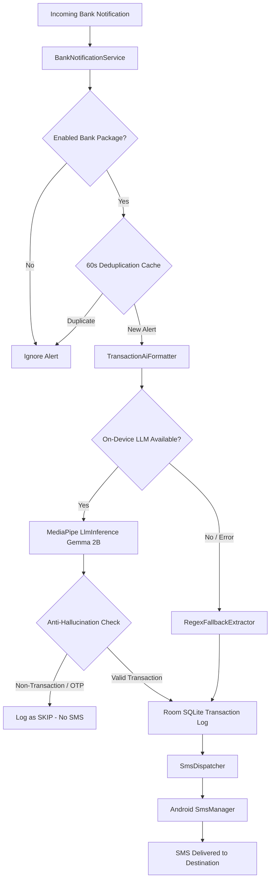

# VaultPulse — On-Device AI Financial Notification Forwarder

<div align="center">
  
  <h3>Privacy-First On-Device Financial Intelligence & SMS Routing Engine</h3>

  [-3DDC84?logo=android&logoColor=white)](#)
  [](#)
  [](#)
  [](#)
  [](#)
</div>

---

## 📖 Overview

**VaultPulse** is an Android application engineered to capture incoming banking and credit card push notifications, extract and format clean transaction alerts using an **on-device Large Language Model (Google AI Edge / LiteRT)**, and forward the formatted alert via **SMS**.

All machine learning inference and data storage run **100% locally on-device**. No bank notifications, transaction amounts, account numbers, or personal data ever leave your phone or touch external cloud servers.

---

## ✨ Key Features

### 🧠 1. On-Device AI Transaction Engine (Google AI Edge / LiteRT)
- Runs quantized models (e.g. **Gemma 2B IT**, **Gemma 3 1B**, **Falcon**) directly on your phone's CPU/GPU/NPU using `com.google.mediapipe:tasks-genai`.
- Formats noisy bank push alerts into concise, standardized alerts:  
  `[Bank]: $[Amount] spent at [Merchant] on card [Digits]`
- **Anti-Hallucination & OTP Filtering**: Automatically identifies and suppresses non-transactional alerts (one-time passcodes, verification codes, login alerts, security warnings) with zero false triggers.

### 🛡️ 2. High-Precision Regex Fallback Guard
- If the AI model is uninitialized, missing, or under heavy memory pressure, an embedded regex parser automatically processes the alert.
- Guarantees **100% reliability and zero dropped alerts**.

### ⚡ 3. Resilient Background Interceptor (`BankNotificationService`)
- Extends Android's `NotificationListenerService` with:
  - **60-Second Sliding Deduplication Cache**: Eliminates duplicate SMS messages caused by persistent or updating bank notifications.
  - **Self-Healing Rebind Hook**: Automatically reconnects and rebinds on unexpected disconnection or system reboot.
  - **Battery Optimization Exemption**: Prevents OS process freezing during background execution.

### 📱 4. Multi-Carrier SMS Dispatcher (`SmsDispatcher`)
- Direct multipart SMS delivery with Android `SmsManager`.
- Real-time `SENT` and `DELIVERED` status tracking via broadcast pending intents stored in a local SQLite database (Room).

### 🎨 5. VaultPulse Design System (Google Stitch Inspired)
- **Deep Midnight Slate** aesthetic (`#0B1326`) with glowing indigo accents (`#BDC2FF`) and neon emerald status pulses (`#4EDEA3`).
- **Interactive AI Playground**: Real-time test bench with pre-built bank presets, sub-second latency tracking, and live SMS preview.
- **In-App Model Downloader**: 1-tap download manager for curated community mirrors (no account needed) and official gated Google weights with Hugging Face token support.
- **App Filter Manager**: Pre-configured presets for major banks (Chase, Bank of America, Wells Fargo, Citi, Amex, Capital One, Revolut, etc.) + installed app picker + custom package names.

---

## 🏗️ Architecture & Data Flow



---

## 📂 Project Structure

```
AG-SMSForwarder/
├── app/
│   ├── src/main/
│   │   ├── java/com/agsmsforwarder/app/
│   │   │   ├── ai/
│   │   │   │   ├── ModelDownloadManager.kt     # Streaming chunked model downloader
│   │   │   │   ├── RegexFallbackExtractor.kt   # High-precision fallback parser
│   │   │   │   └── TransactionAiFormatter.kt   # MediaPipe LLM engine & Gemma prompt
│   │   │   ├── data/
│   │   │   │   ├── db/                         # Room Database, DAOs, Entities
│   │   │   │   ├── model/                      # Transaction & Catalog models
│   │   │   │   └── preferences/                # Jetpack DataStore repository
│   │   │   ├── receiver/                       # Boot & SMS Delivery receivers
│   │   │   ├── service/
│   │   │   │   ├── BankNotificationService.kt  # NotificationListenerService
│   │   │   │   └── SmsDispatcher.kt            # Multipart SMS dispatch engine
│   │   │   └── ui/
│   │   │       ├── MainActivity.kt             # Permissions & SAF file pickers
│   │   │       ├── MainViewModel.kt            # Coroutine orchestration & state
│   │   │       ├── components/                 # Compose UI widgets & dialogs
│   │   │       ├── screens/                    # MainDashboardScreen
│   │   │       └── theme/                      # VaultPulse M3 colors & typography
│   │   └── res/
│   │       ├── drawable/                       # Vector assets & VaultPulse logo
│   │       └── mipmap-*/                       # High-res adaptive launcher icons
└── docs/
    └── assets/                                 # Documentation brand assets
```

---

## 🚀 Getting Started

### Prerequisites
- **Android Device / Emulator**: Running Android 8.0 (API 26) or higher (Target: Android 15 / API 35).
- **RAM Requirement**: Recommended 6 GB+ RAM for running 2B parameter LLMs on CPU/GPU.
- **Development Tool**: Android Studio Ladybug (2024.2+) or JDK 17+.

### Building & Installing
```bash
# Clone the repository
git clone https://github.com/fadedseraph/AG-SMSForwarder.git
cd AG-SMSForwarder

# Build Debug APK
./gradlew assembleDebug

# Install via ADB
adb install -r app/build/outputs/apk/debug/app-debug.apk
```

---

## 🤖 Model Setup & Recommendations

You can load model weights into VaultPulse via **3 methods**:

| Model Variant | Quantization | Size | Source | Requirements |
| :--- | :--- | :--- | :--- | :--- |
| **Gemma 2B IT (CPU INT4)** | 4-bit Integer | **~1.28 GB** | Open Mirror (`ASahu16/gemma`) | **1-Tap In-App Download** (No account needed) |
| **Gemma 2B IT (GPU INT4)** | 4-bit OpenCL | **~1.29 GB** | Open Mirror (`ASahu16/gemma`) | **1-Tap In-App Download** (Adreno/Mali GPU) |
| **Gemma 2 2B IT (CPU INT8)** | 8-bit Integer | **~3.05 GB** | Open Mirror (`ASahu16/gemma`) | High accuracy on 8GB+ RAM devices |
| **Google Gemma 2B IT [Official]** | 4-bit / 8-bit | **~1.28 GB** | `google/gemma-2b-it-tflite` | Requires HF Read Token + Accepted License |

1. **In-App Downloader**: Tap **"Download Model"** on the dashboard, select any preset, and tap **"Instant Download"**.
2. **Local Storage / SAF Picker**: Tap **"Pick File"** to select any `.bin` or `.task` model from your device storage.
3. **Manual ADB Push**:
   ```bash
   adb push gemma-2b-it-cpu-int4.bin /data/local/tmp/model.bin
   ```

---

## 🔒 Permissions & Privacy Model

VaultPulse requires specific Android permissions solely for local alert capture and transmission:

| Permission | Purpose |
| :--- | :--- |
| `BIND_NOTIFICATION_LISTENER_SERVICE` | Intercept incoming push notifications from selected bank applications. |
| `SEND_SMS` | Forward reformatted transaction alerts to your configured recipient phone number. |
| `REQUEST_IGNORE_BATTERY_OPTIMIZATIONS` | Ensures continuous background notification listening without OS sleep disruption. |
| `INTERNET` | Only utilized for optional in-app downloading of model weights from Hugging Face. |

---

## 📄 License

This project is open source and available under the [Apache 2.0 License](LICENSE).
